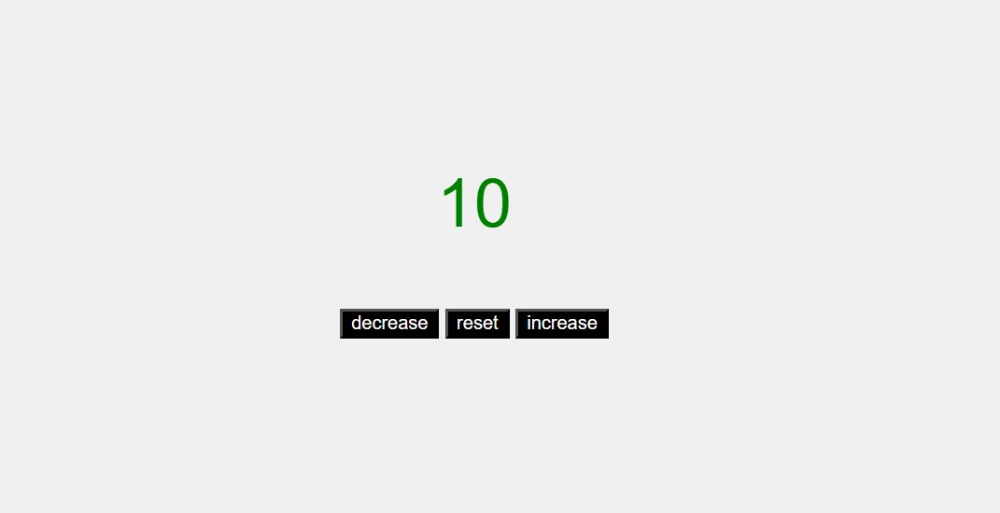
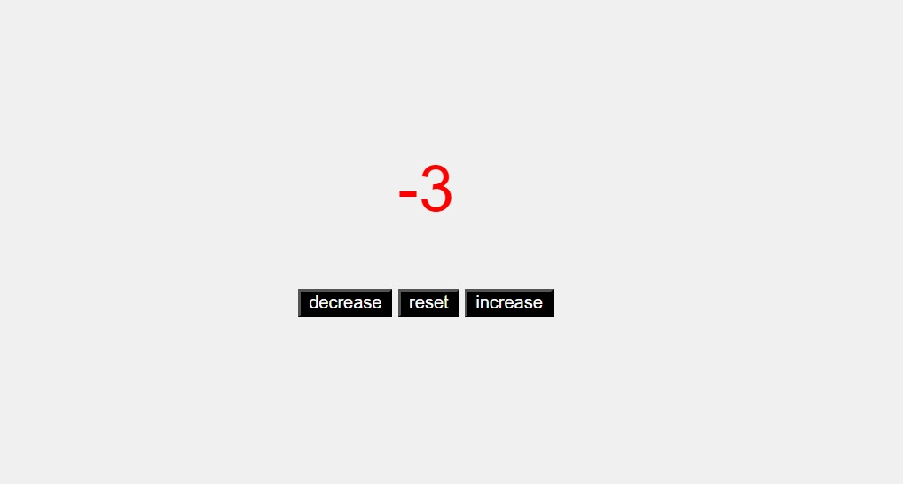

# Number Counter Web App

This simple web app allows you to display and manipulate a number in the center of the page. The number will change color based on its value: green for positive, red for negative, and black for zero.

## Features

- Display a number in the center of the page.
- Increment the number by clicking the "Increment" button.
- Decrement the number by clicking the "Decrement" button.
- Reset the number to 0 by clicking the "Reset" button.
- The number changes color based on its value: green for positive, red for negative, and black for zero.

## Screenshots

*Positive Number*

*Negative Number*

*Zero Number*

